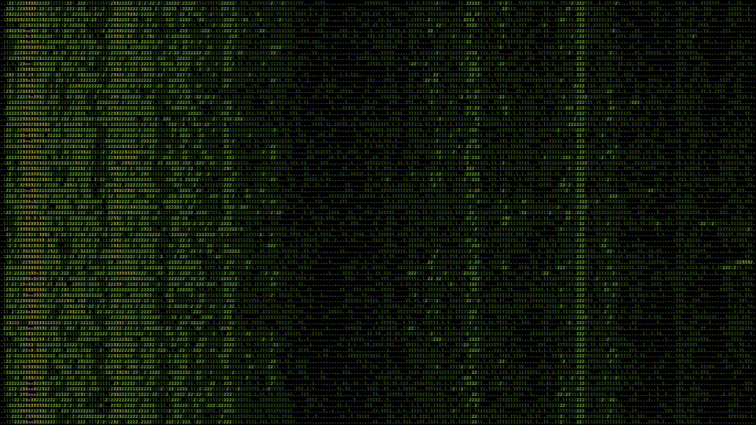
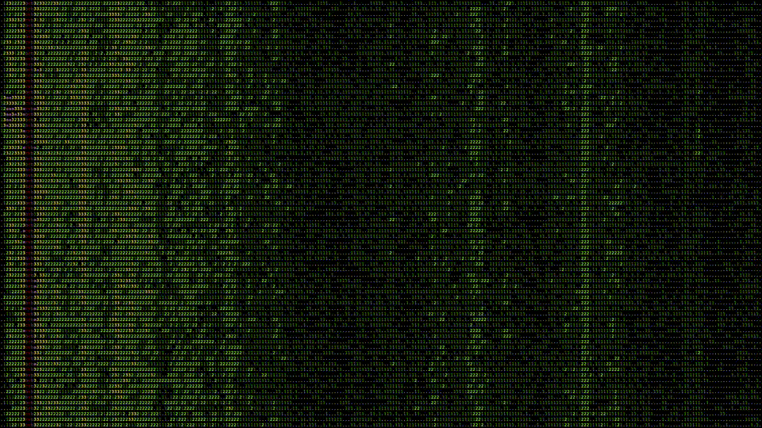

Live spectrogram
================

Run `livespectro.py` to record from your computer microphone and print a colorized live spectrogram of every 200 ms of audio in 5 Hz buckets.

Useful if you want to check if it's a comfortable time to take off your noise-canceling headphones and let your ears get some air.

The color scale is taken from the excellent mtr utility.

brum.py
-------

Run `brum.py` to watch out for when there is a low frequency buzz around 50-55 Hz and give you a desktop notification to take your headphones on/off.

Useful if your desk is right next to a fridge/freezer with a loud compressor that turns off and on periodically.

Coincidentally, this is what livespectro.py looks like when my fridge/freezer is on:

